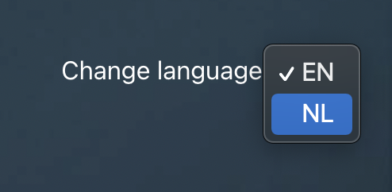
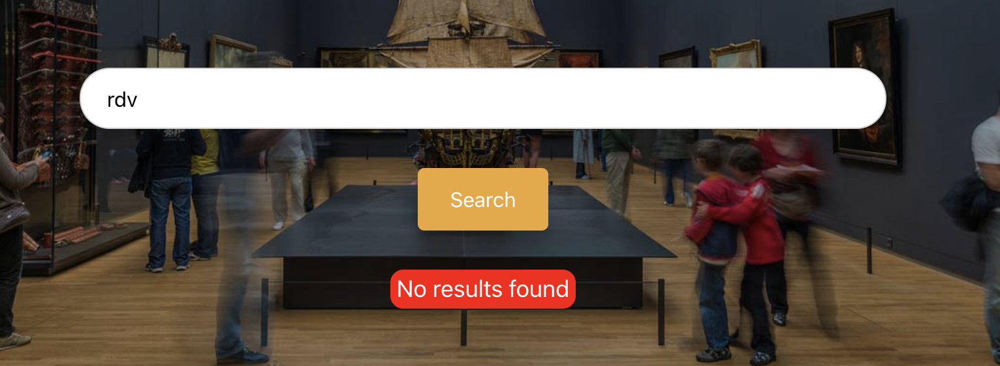
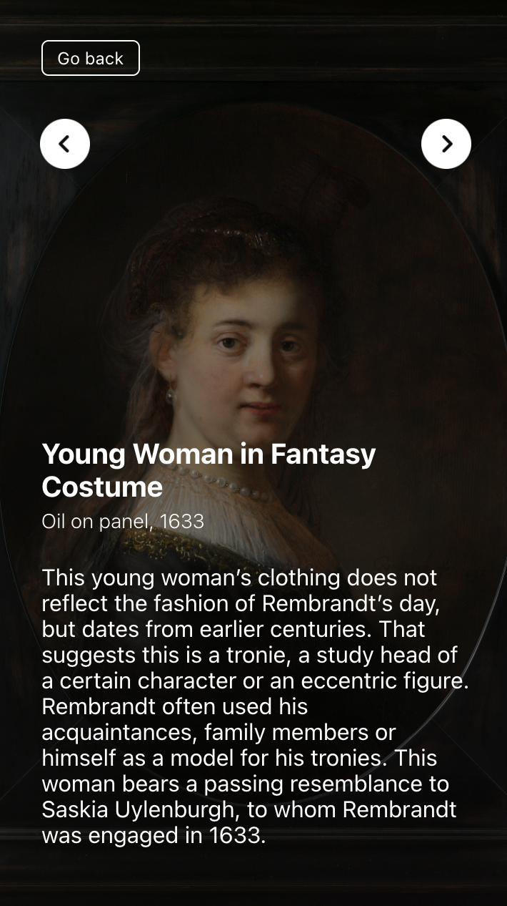

# Rijks Museum API

---

# Introduction
> This website shows the Rijksmuseum's collection, thanks to [Rijksmuseum API](https://data.rijksmuseum.nl/object-metadata/api/).

---

## Approach to solution 

1) Create a mockup for the website.
2) Create an account [here ](https://www.rijksmuseum.nl/en/rijksstudio), in order to get the key to use the API.
4) Create a new project and install react.js
3) Get the result desired from the API visible on the browser, with no style on the website yet.
4) Use Redux to remember the results from the API and show in the details page the next and the previous result.
5) Add style designed previously.
6) Check responsiveness.
7) Test the website in various screens.
8) Resolve bugs.
---

## Usage 
 - The website starts with **english** as default value for the search, but the user can change it to **dutch** as well.
 

 - If the API does not give back data, the user will see a feedback message **"No results found"**.
 

- By clicking **Next** and **Previous** buttons, the user can visualize the next or previous collection, from the previous search.

---
## Browser compatibility
 - Brave
 - Safari
 - Chrome
 - Firefox

  Mobile:
  - Android Xiaomi Redmi 5 plus
  - iOS Iphone 8

## Technologies
Project is created with:
+ Visual Studio Code

[Netlify](https://challenge-rijksmuseum.netlify.app/)

---
## Authors - TEAM
+ **Khazour Rania** (Junior Front-end developer)

---
## Contact information
- rania.khazour99@gmail.com
